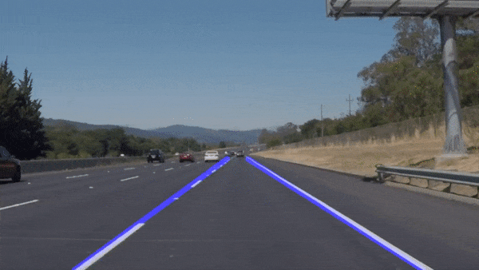
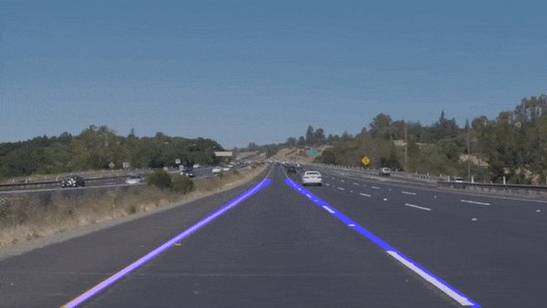

# **Finding Lane Lines on the Road** 

OVERVIEW
---

When we drive, we use our eyes to decide where to go.  The lines on the road that show us where the lanes are act as our constant reference for where to steer the vehicle.  Naturally, one of the first things we would like to do in developing a self-driving car is to automatically detect lane lines using an algorithm.

OUTPUT:

## SOLUTION 

The goal was to detect lane lines using Python and OpenCV. For full details checkout the jupyter notebook. Note: Lines may be straight, curved, or colored (i.e. yellow boundary lines, weather, TOD, etc.).

### ALGORITHM PIPELINE
1. Import Packages to be used.
2. Read the image.
3. Convert image to grayscale.
4. Apply Gaussian Noise Kernal.
5. Mask the region of interest.
6. Apply Hough Transform.
7. Approximate the left lane from positive slope lines, right from negative, and overlay them onto the image(s) 

## LIMITATIONS

One potential shortcoming would be that when slopes of the lanes are both negative or positive the detection will fail. Also when the edge detection falls outside of the thresholds of the parameters (this needs to be more throughtly tested) the algorithm may not be able to detect the lane. Lastly, if there are obstacles obstructing the cameras view, it will fail.
## Future Improvements

A possible improvement would be to run an optimization function on the parameters used to tune it futher, rather than having to predict these. Smoothen out the video by incorporating previous frames into the current frames prediction would greatly enhance the display of the output, and correct for any outliers.
